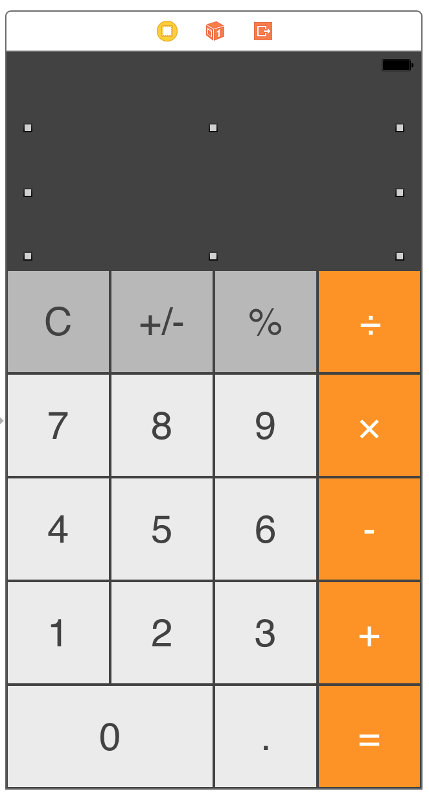
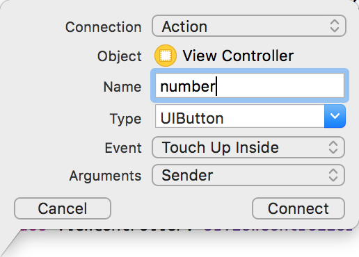

## Calculator

继 **ToDo** 之后，出于对 **Swift** 的好奇，做了一个比较丑的计算器(苹果手机里自带的那个哟)

### 原型设计

直观一些，直接上样稿图片



>* 原型完成后要对数字 **0-9** 的10个数字设置 **View tag** .
>* 从 0-9 依次是 0，1，2，3 ... 依次类推，设置 View tag ！
>* C，加，减，乘，除 依次 11，12，13 ... 依次类推，设置 View tag ！

### 原型与代码连接
按住 Control 选中 数字 0 ，向 UIViewController 下方拖曳会出现



设置好相关属性，代码块里会显示，如下代码

```swift
@IBOutlet weak var label: UILabel!

@IBAction func numbers(_ sender: UIButton){
	code ...
}
```

>* UILabel 是 label 显示结果
>* UIButton 是 **0-9，清零，加，减，乘，除** 的动作方法

### 完整代码示例如下：

```swift
//
//  ViewController.swift
//  Calculator
//
//  Created by 欧阳晓锡 on 2017/9/10.
//  Copyright © 2017年 Oyxiaoxi. All rights reserved.
//

import UIKit

class ViewController: UIViewController {
    
    var numberOnScreen:Double = 0
    var perviousNumber:Double = 0
    var performingMath = false
    var operation = 0
    
    @IBOutlet weak var label: UILabel!
    
    @IBAction func numbers(_ sender: UIButton)
    {
        if performingMath == true
        {
            label.text = String(sender.tag-1)
            numberOnScreen = Double(label.text!)!
            performingMath = false
        }
        else
        {
            label.text = label.text! + String(sender.tag-1)
            numberOnScreen = Double(label.text!)!
        }
    }
    
    @IBAction func buttons(_ sender: UIButton)
    {
        if label.text != "" && sender.tag != 11 && sender.tag != 16
        {
            perviousNumber = Double(label.text!)!
            if sender.tag == 12 //Divide
            {
                label.text = "÷"
            }
            else if sender.tag == 13 //Multiply
            {
                label.text = "×"
            }
            else if sender.tag == 14 //Minus
            {
                label.text = "-"
            }
            else if sender.tag == 15 //Plus
            {
                label.text = "+"
            }
            operation = sender.tag
            performingMath = true
        }
        else if sender.tag == 16
        {
            if operation == 12
            {
                label.text = String(perviousNumber / numberOnScreen)
            }
            else if operation == 13
            {
                label.text = String(perviousNumber * numberOnScreen)
            }
            else if operation == 14
            {
                label.text = String(perviousNumber - numberOnScreen)
            }
            else if operation == 15
            {
                label.text = String(perviousNumber + numberOnScreen)
            }
        }
        else if sender.tag == 11
        {
            label.text = ""
            perviousNumber = 0
            numberOnScreen = 0
            operation = 0
        }
    }
    override func viewDidLoad() {
        super.viewDidLoad()
        // Do any additional setup after loading the view, typically from a nib.
    }

    override func didReceiveMemoryWarning() {
        super.didReceiveMemoryWarning()
        // Dispose of any resources that can be recreated.
    }
}


```


